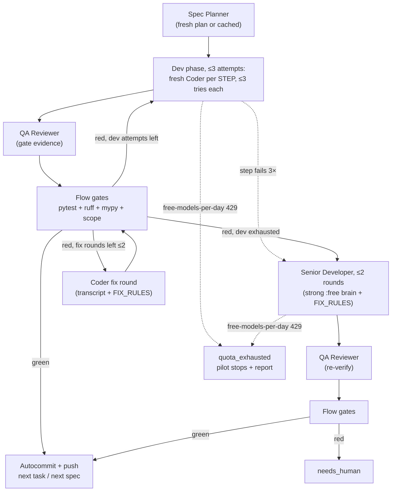

# Swarm harness — usage

Free-first CrewAI swarm that implements `specs/` tasks one at a time (`specs/009-swarm-harness/`).
Pilot scope: `001-T1` only. Roles: Planner + Coder + Reviewer, sequential.

## Prereqs
- `uv` installed; Python 3.12 available (`uv python list`). System Python 3.14 does NOT work with CrewAI (`>=3.10,<3.14`).
- Ollama serving locally: `ollama serve` + `ollama pull qwen3.5:9b` (default `OLLAMA_BASE_URL=http://localhost:11434`).
- Keys (never commit): root `.env` with `OPENROUTER_API_KEY` (planner/reviewer `:free` models), `OPENCODE_API_KEY` (Zen free fallback).

## Setup
```bash
uv venv -p 3.12 swarm/.venv
VIRTUAL_ENV="$PWD/swarm/.venv" uv pip install -p "$PWD/swarm/.venv/bin/python" -e 'swarm/[dev]'
cp .env.example .env   # optional overrides (keys stay empty until you fill them)
swarm/.venv/bin/python -c "from crewai import LLM,Agent,Task,Crew; print('ok')"
```

## Model tiers (`swarm/llms.py` — the only file that picks models)
| Role | Default | Cost |
| --- | --- | --- |
| Coder | `SWARM_CODER_MODEL=ollama/qwen3.5:9b` (local) | $0 |
| Planner | `SWARM_PLANNER_MODEL=ollama/qwen3.5:9b` (local default; set to a `:free` id for cloud brains) | $0 |
| Reviewer | `SWARM_REVIEWER_MODEL=ollama/qwen3.5:9b` (local default; set to a `:free` id for cloud brains) | $0 |
| Fallback | `SWARM_ZEN_FALLBACK_MODEL=openai/muse-spark-1.3-contributor-free` via Zen | $0 |

> 2026-10-10: OpenRouter `:free` shared pool returns upstream 429s under agentic-loop
> load, so defaults are all-local. Cloud `:free` still works via env override when quota allows.

Paid models are hard-blocked: any non-`:free`/non-local/non-`-free` id raises `PermissionError`
unless `SWARM_ALLOW_PAID=1` in env. Override ids via env, never in code.

Model prefixes route automatically: `ollama/*` → local Ollama, `zen/*` → OpenCode Zen
(`custom_openai` gateway mode), anything else → OpenRouter. Stronger $0 brains, verified 2026-10-10:
- Planner: `SWARM_PLANNER_MODEL=openrouter/nvidia/nemotron-3-super-120b-a12b:free`
- Reviewer: `SWARM_REVIEWER_MODEL=zen/space-bunny-free`
- Coder stays local (`ollama/qwen3.5:9b` + `extra_body={"think": False}`, required for tool calls).

## Run
```bash
make swarm-run                 # pilot 001-T1 headless (or ./swarm/run.sh 001 T1)
make swarm-local               # all-local pilot: Ollama Qwen for every role (overrides cloud .env)
make swarm-dash                 # dashboard attached to the current pilot
make swarm-up                   # pilot in background + dashboard attached
make swarm-up-local             # all-local pilot in background + dashboard attached
make swarm-test                 # harness unit tests (no LLM, no network)
make swarm-coder-image          # build tuned coder image (swarm/ollama/Modelfile → swarm-coder:latest)
```

Coder image: `swarm/ollama/Modelfile` (`FROM qwen3.5:9b`, temp 0, `num_ctx 65536`,
baked SYSTEM discipline). Use it via `SWARM_CODER_MODEL=ollama/swarm-coder:latest`.
Verified 2026-10-10: builds offline from local blobs, native tool calls work
(with the harness's `think:false`). Tune `num_ctx`/SYSTEM in the Modelfile and rebuild.
Keys: `a`=approve (writes `approved.json`), `r`=retry (new run, same spec/task), `q`=quit.

`--spec` accepts a prefix (`001` → `001-example-app`). Each run writes:
- `swarm/runs/<ts>/run.json` — spec, task, status (`green`/`needs_human`/`crew_error`), gate exit codes, cost (must be `0` for T8).
- `swarm/runs/<ts>/events.jsonl` — streamed agent events; `usage.json` when available.

## Agent tools (guarded, `swarm/tools_guarded.py`)
- `Repo Edit` — exact-match replace, exactly-once occurrence required, repo jail (no path escapes).
- `Repo Create` — new files only (makes parent dirs, refuses existing/escapes). Scaffold needs it: without it the coder cannot create `app/__init__.py` et al.
- `Guarded Shell` — allowlist only: `pytest`, `ruff`, `mypy` (gates); `git diff/status` (read-only); `ls`, `cat`, `grep` (read-only inspection); `npm` (frontend gates). 120s timeout, repo cwd. Deliberately absent: `python -c` (arbitrary exec), `sed/awk` (writes — use Edit/Create), `curl` (no network), `pip/uv` (agents don't manage envs).
- Read-only: trimmed file reads (3000 chars max); `ls` via Guarded Shell (no directory-search tool).

## Gates (sequence)
Planner splits the task into `STEP n:` micro-steps → one fresh coder per step (fresh
context each, max 8 steps) → Reviewer verifies once at the end → `flow` re-runs
`pytest` + `ruff check .` + `mypy .` itself (never trusts agent claims). Red gates → fix
round: Coder (+ Reviewer re-verify) with the gate transcript, max 2 rounds
(`MAX_FIX_ROUNDS` in `swarm/crew.py`). Still red → `needs_human`, TUI pauses,
`r` starts a fresh run. Crash → one fresh re-kickoff, then `crew_error`.
Plan cache: planner output is saved to `swarm/runs/plans/<spec>-<task>.md`; retries resume
at the micro-steps with the cached plan (`plan_reused: true` in `run.json`). `--replan` forces re-planning.

## Autonomous loop (default)
A green run autocommits in-scope changes (`swarm: <spec>-<task> green … (autocommit)`,
out-of-scope files never added, `.env*` refused) and pushes, then loops back to the
planner for the next task — and after a spec's last task, to the next spec with tasks
(directory order; specs without `tasks.md` and the `009-swarm-harness` spec itself are
skipped). First non-green task stops the whole loop (`needs_human`/`crew_error` in that
task's `run.json`). Flags: `--single` runs only the given task, `--no-commit` skips
autocommit+push (passed through `run.sh` extra args,
e.g. `./swarm/run.sh 001 T1 --single`).

## Escalation (dev ×3 → senior → QA)
Each task gets up to `DEV_ATTEMPTS` (3) dev phases (micro-steps + review + 2 fix rounds
each, cached plan reused). A single micro-step failing `STEP_ATTEMPTS` (3) times is
rescued by the senior inline, then the phase continues. Still red after all dev phases →
up to `SENIOR_ATTEMPTS` (2) senior passes: `SWARM_SENIOR_MODEL`
(OpenRouter `:free`, must differ from planner; Zen free tier is locked to OpenCode
clients) fixes everything in one go via `build_senior_crew`, then QA re-verifies and
gates re-run. Still red → `needs_human`. Attempts + `senior_used` recorded in `run.json`.

Quota: any LLM call failing with `free-models-per-day` stops the pilot immediately —
no retry, no escalation — with status `quota_exhausted`, a `quota_note` in `run.json`,
and a `QUOTA EXHAUSTED` line in `up.log`. Resume after the daily reset.

## Role sequence


## Unit tests (no LLM, no network)
```bash
swarm/.venv/bin/python -m pytest swarm/tests -v
```

## Traces & logs (all inside the project, never `/tmp`)
- Pilot runs: `swarm/runs/<ts>/{run.json,events.jsonl,usage.json}` (+ `latest` pointer, `approved.json`).
- Ad-hoc probes/debug: `swarm/runs/probes/<name>-<date>.log`. `swarm/runs/` is gitignored.

## Anti-loop guards (Qwen-9B wanders: re-reads files, blows 262k ctx)
- `TrimmedFileReadTool`: observations capped at 3000 chars (re-read via `start_line`/`line_count`).
- No `DirectoryReadTool`: `ls` via Guarded Shell has fewer wandering branches.
- Task prompts carry hard loop rules (≤6 tool calls, never re-read, answer from observations).
- `max_iter` 10/10/5 + 1 fix round max. Still stuck → `needs_human`.

## Troubleshooting
- `429 free-models-per-min` (OpenRouter): per-minute quota on `:free` (20/min). Wait ~60s and retry; LLMs already set `max_retries=5`. Persistent → change `SWARM_PLANNER_MODEL` to another `:free` id from `curl "https://openrouter.ai/api/v1/models?supported_parameters=tools&sort=pricing-low-to-high"`.
- `Python >=3.10,<3.14 required`: recreate venv with `-p 3.12`.
- Ollama refused: `ollama serve`; check `curl http://localhost:11434/api/tags`.
- `Invalid response from LLM call - None or empty` on local Qwen: thinking blocks break tool parsing — harness already sets `extra_body={"think": False}` on all Ollama LLMs; if you add a new Ollama model id, keep it. Single transient empties still occur; `flow` re-kicks the crew once automatically.
- Local Qwen-9B as **planner** loses the plot (verified 2026-10-10: listed `.git/` internals, asked "what would you like to do" instead of writing the plan). Keep cloud brains (OpenRouter `:free` / Zen) for planner + reviewer; local Qwen is coder-only material with reviewer gates.
- `swarm/.venv/`, `swarm/runs/`, `swarm/.env` are gitignored — safe to run freely.
